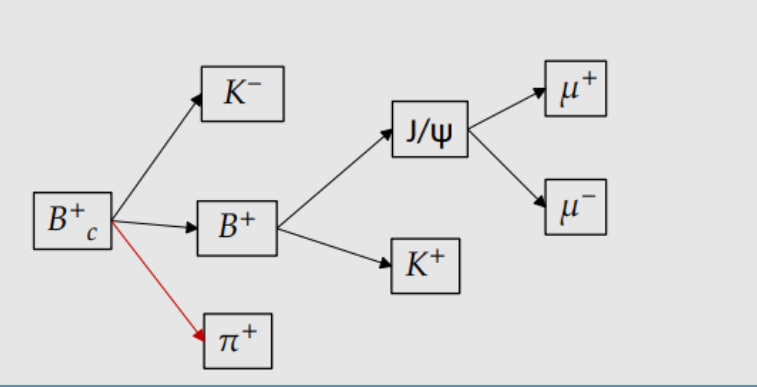

### Устройство директории 

* **Xb_frame** - в ней лежит файл на с++ для загрузки на сервер и первой обработки сырых данных треков.
* **MySelector** - директория с файлом вторичной обработки данных MySelector, в котором накладываются дополнительные каты и происходит создание более выскоуровневых переменных для дальнейшего анализа.
* *Bc_mass_plot.py* . Программа построения графика инвариантной массы Bc и фитирования. Внутри программы нужно написать именна обработанных root файлов и необходимые каты, если требуется.

### Топология распада

### Каты

* transverse momentum of muons > 3 [Gev]
* η of muons < 2.4
* Transverse momentum of Kaon from B > 1.2 [GeV]
* p4k1.DeltaR(p4mum_0c) > 0.01
* η of Kaon from B < 3
* Transverse momentum of Kaon from 𝐵𝑐 > 1 [GeV]
* η of Kaon from 𝐵𝑐 < 3
* Transverse momentum of π > 0.4 [GeV]
* η of π < 3
* vertex probability of 𝐵𝑐 > 0.05
* vertex probability of B > 0.02
* B and K from 𝐵𝑐 have opposite sign, B and π has the same sign

Каты на trigger mathcing:
поперечный импульс каона из распада B мезона  меньше 0.1

