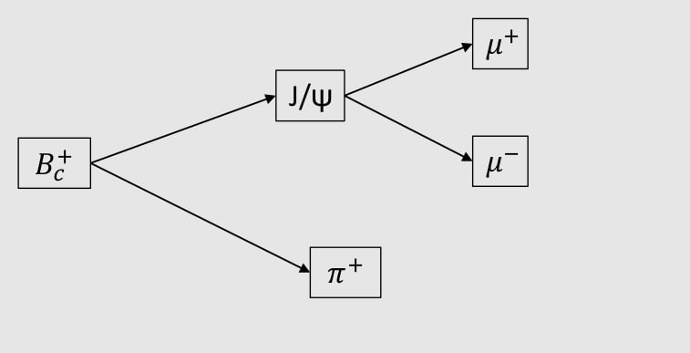

### Устройство директории 

* **Xb_frame** - в ней лежит файл на с++ для загрузки на сервер и первой обработки сырых данных треков.
* **MySelector** - директория с файлом вторичной обработки данных MySelector, в котором накладываются дополнительные каты и происходит создание более выскоуровневых переменных для дальнейшего анализа.

### Топология распада

